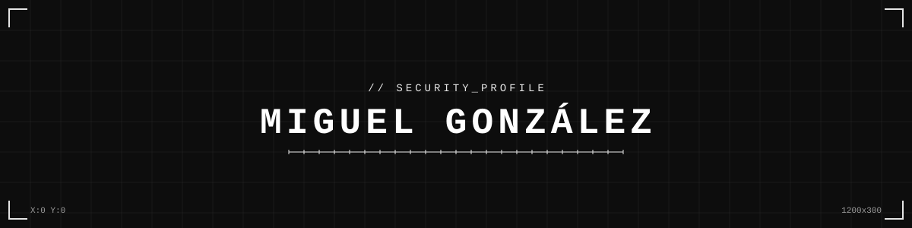
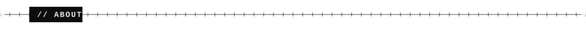
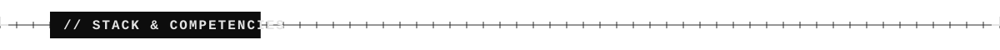
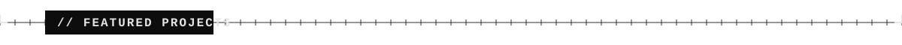
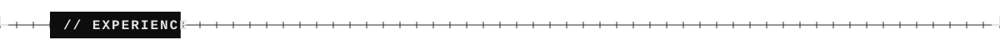
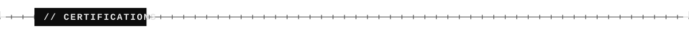
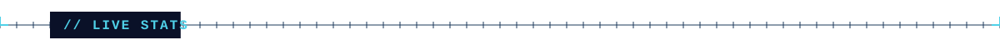

Security engineer who builds offensive tooling and hardens enterprise systems — working both sides of the fence. Three years securing critical infrastructure for major Spanish corporations and government departments; since 2024, building AI red-team tooling and running adversarial testing against LLMs — prompt injection, agent and MCP security, penetration testing, SOC operations.

Currently focused on leading offensive security against AI/ML systems while feeding findings back into detection and defense.

**Offensive Security**

**Defensive Security**

**Platforms**

**Development**

**AI & Automation**

<table>
<tr>
<td width="50%" valign="top">

### [Verax](https://veraxai.xyz)
Shadow-AI discovery & governance platform. Ingests logs across your security stack to find AI tools in use, scores vendor data-handling risk, maps Entra ID OAuth grants, exports to SIEM (CEF/OCSF/syslog), and generates AI risk-assessment reports.

`Python` · `FastAPI` · `Next.js`

</td>
<td width="50%" valign="top">

### [Mentra](https://mentra.cc)
Chrome extension shipped from zero to production in under 3 months — 335 downloads, 34 active users. JWT auth, SSE streaming, Stripe billing end-to-end.

`Next.js 15` · `Supabase` · `Groq / LLaMA 3.1` · `Stripe`

</td>
</tr>
</table>

> `2022.10 → 2024.04` **NTT** · Technical Services Engineer · Spain
> - Designed, implemented, and migrated end-to-end security architectures (Fortinet, Check Point, Palo Alto, Nozomi) for Spain's largest corporations and government departments
> - Cut mean time to remediation by 35% across 12+ enterprise clients — led vulnerability assessments, automated remediation with Python/Bash
> - Cut firewall misconfiguration incidents by 40% establishing hardening standards across multi-vendor environments
> - Accelerated security project delivery by 25% owning design, implementation, and client handover end-to-end

> `2022.05 → 2022.10` **Westcon-Comstor** · Support Engineer · Spain
> - Decreased incident resolution time by 30% overhauling security incident management and automated monitoring alerts
> - Strengthened security posture for 5+ clients hardening enterprise firewalls (Fortinet, Check Point, Palo Alto)

> `2021.04 → 2022.05` **Westcon-Comstor** · Support Center Operator Trainee · Spain
> - Contributed to a 20% reduction in open SOC tickets — incident resolution, network administration, vulnerability assessment

| Certification | Issuer | Year |
|---|---|---|
| AI Red Teamer | Hack The Box | 2026 |
| Claude 101 | Anthropic | 2026 |
| AI Fluency: Framework and Foundations | Anthropic | 2026 |
| Red Teaming Path | TryHackMe | 2025 |
| Jr Penetration Tester | TryHackMe | 2025 |
| NSE 3 Network Security | Fortinet | 2023 |
| NSE 1–2 | Fortinet | 2022 |

Madrid, Spain · Remote
 

