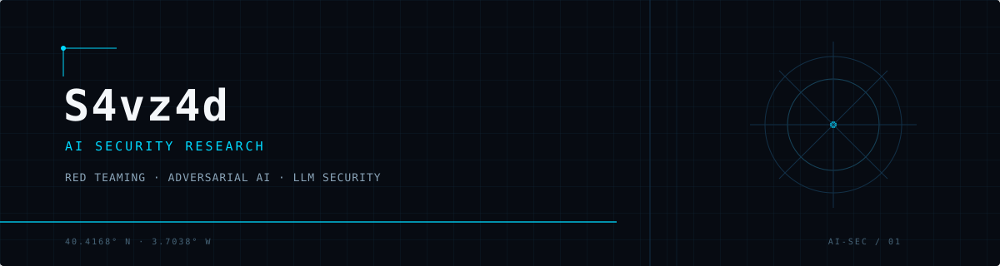
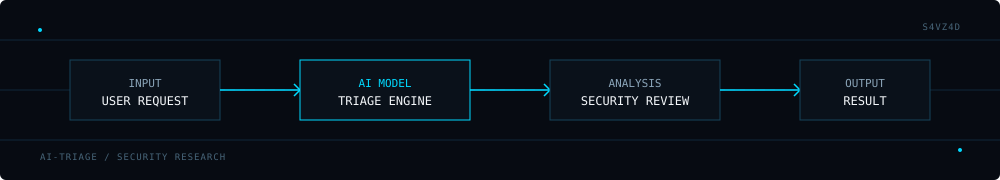

S4vz4d

   

AI Security Research · AI Red Teaming · Adversarial AI

 

LinkedIn

01 — Expertise
<table> <tr> <td width="50%" valign="top">
LLM Security

Security research focused on the behavior, limitations and attack surface of large language models.

</td> <td width="50%" valign="top">
AI Red Teaming

Adversarial testing of AI systems to identify security weaknesses and unexpected model behavior.

</td> </tr> <tr> <td width="50%" valign="top">
Prompt Injection

Research into indirect and direct prompt injection techniques and their impact on AI applications.

</td> <td width="50%" valign="top">
AI Application Security

Security assessment of AI-powered applications, integrations and agentic workflows.

</td> </tr> </table>
02 — Featured Work
AI-TriageBot_redTeam

AI security research and adversarial testing focused on an AI-powered triage system.

Focus

AI Security · Red Teaming · LLMs · Python

  
03 — Research Focus
AI SYSTEMS
     │
     ├── LLMs
     ├── AI Applications
     ├── Agents
     └── Tool-using Systems
             │
             ▼
      SECURITY RESEARCH
             │
     ┌───────┼────────┐
     ▼       ▼        ▼
  Adversarial  Threat  Security
   Testing     Modeling  Analysis

My current interests include adversarial evaluation, AI application security, LLM security and the security implications of increasingly autonomous AI systems.

04 — Toolkit

       

05 — Connect

   

S4vz4d · AI Security Research

